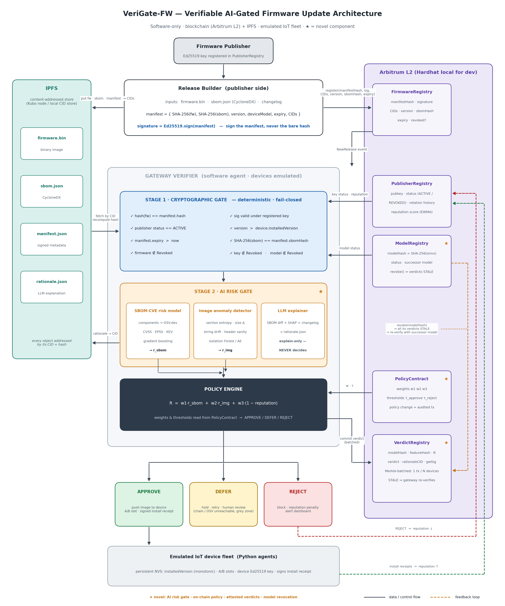
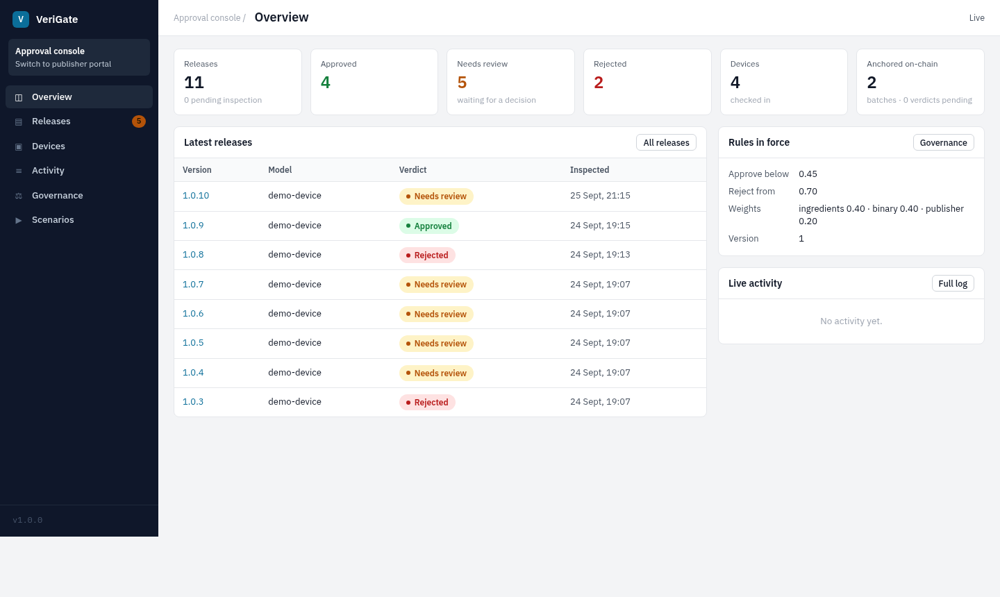
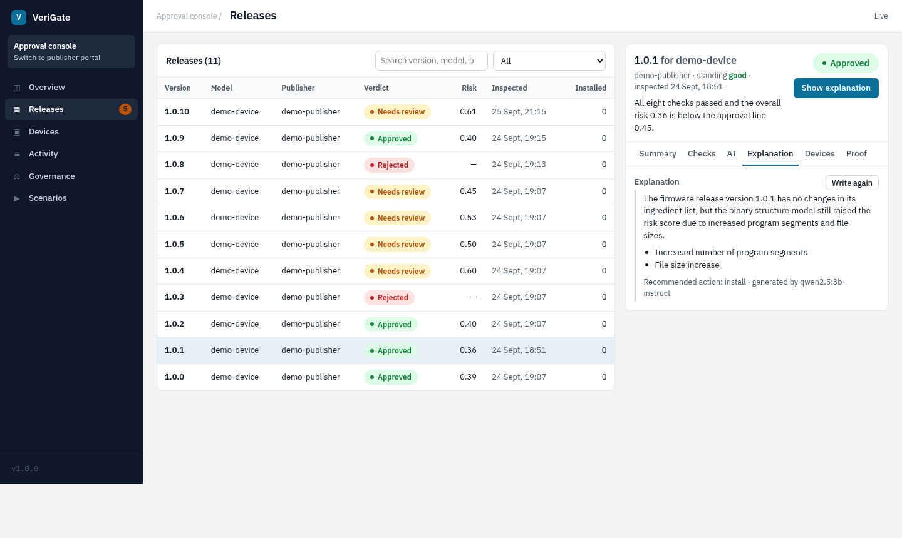
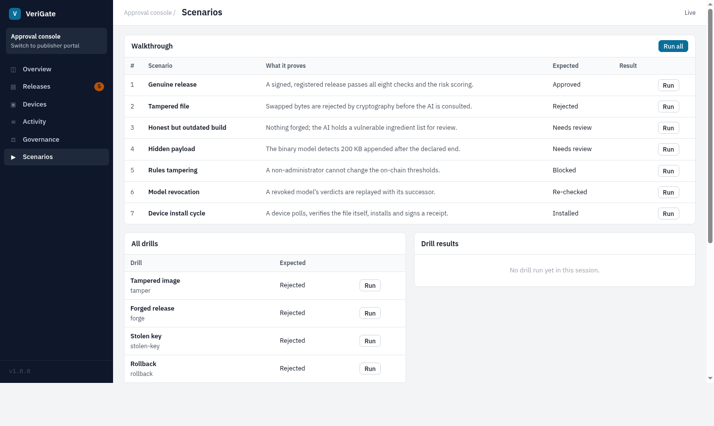
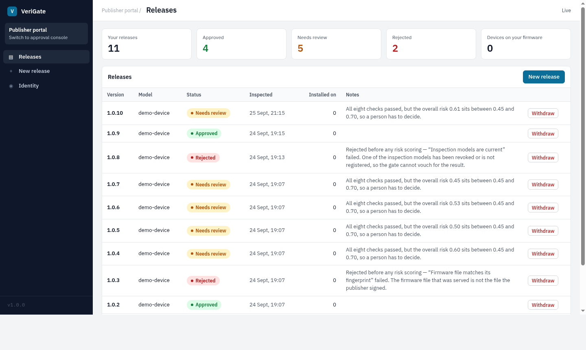

<div align="center">



<br/>
<br/>

<picture>
  <source media="(prefers-color-scheme: dark)" srcset="https://readme-typing-svg.demolab.com?font=IBM+Plex+Sans&weight=700&size=36&duration=3500&pause=1000&color=F6F7F9&center=true&vCenter=true&width=760&lines=VeriGate-FW;Verifiable+AI-gated+firmware+updates">
  
</picture>

<picture>
  <source media="(prefers-color-scheme: dark)" srcset="https://readme-typing-svg.demolab.com?font=IBM+Plex+Sans&weight=300&size=19&duration=3500&pause=99999999&color=F6F7F9&center=true&vCenter=true&width=760&lines=Cryptography+decides+who.+Models+score+how+safe.+The+chain+remembers+both.">
  
</picture>

<br/>

[](https://www.python.org/)
[](https://soliditylang.org/)
[](https://react.dev/)
[](https://onnx.ai/)
[](LICENSE)

[](tests/)
[](tests/)
[](CHANGELOG.md)
[](docs/paper/main.pdf)

</div>

<br/>

## What it is

Over-the-air updates are how IoT fleets get fixed **and** how they get attacked. Signature schemes
answer *who* built an update, not whether a genuine update is *safe* to install. VeriGate-FW is a
software-only update gate that combines:

- **A deterministic stage** — eight fail-closed checks against on-chain publisher, firmware and model registries. It can only reject or defer.
- **An AI risk stage** — an SBOM vulnerability model and a firmware-image anomaly model, exported to ONNX and registered *by hash*. An on-chain policy turns their scores into **approve / needs review / reject**.
- **Accountable verdicts** — every verdict names the model hashes that produced it, commits to its feature vector, and is anchored on-chain in Merkle batches.
- **Revocable models** — revoke a model hash and every verdict it produced goes stale; the gateway swaps to the successor and re-verifies the affected devices.
- **An explain-only language model** — a local `qwen2.5:3b-instruct` writes a plain-language rationale on request. It is stored, never consulted by the decision.

Everything is measured on one laptop against a local Hardhat chain and IPFS node, and the
failures are reported next to the successes (`docs/limitations.md`).

<br/>

##  The console

<div align="center">

| Approval console | Explain with AI |
|:---:|:---:|
|  |  |
| **Scenarios & drills** | **Publisher portal** |
|  |  |

</div>

Two workspaces behind one front door: the **approval console** (`/app` — overview, releases with
checks · AI · explanation · devices · on-chain proof, devices, live activity, governance with a
rules simulator, and runnable scenarios) and the **publisher portal** (`/publisher` — your
releases, a new-release dialog, withdraw, identity).

---

<br/>

##  Quick start

**Demo mode — only Docker needed**

```bash
git clone https://github.com/Jebin-05/verigate-fw.git && cd verigate-fw
make doctor         # checks docker, RAM, disk, free ports
make up             # chain, IPFS, contract deploy, model registration, gateway, fleet, dashboard
make smoke          # proves the stack reaches an APPROVE verdict end to end
make llm-pull       # optional: the explainer (qwen2.5:3b-instruct, ~1.9 GB, CPU only)
```

Open **http://localhost:5173**. Works on Linux, macOS (Docker Desktop) and Windows (WSL2 + Docker
Desktop); no Python or Node on the host.

**Host mode — hot reload**

```bash
make bootstrap      # venv, python deps, node deps
make infra-up       # hardhat node + IPFS in docker
make contracts-deploy-local && make models-register
make gateway        # FastAPI on :8000
make fleet N=20     # 20 emulated devices
make dashboard      # Vite on :5173
```

**Publish a release from the CLI**

```bash
verigate-publish keygen && verigate-publish register
verigate-publish release --fw tests/fixtures/releases/v1.0.0/firmware.bin \
    --sbom tests/fixtures/releases/v1.0.0/sbom.json --version 1.0.0 \
    --model demo-device --expiry 2030-01-01T00:00:00Z --json
verigate-publish revoke <releaseId>
```

Every command prints one JSON object and is idempotent: same inputs → same CIDs.

**Run the demo**

```bash
./scripts/demo.sh                 # publish → devices install → eleven attacks caught
DEMO_MODE=host ./scripts/demo.sh  # against make gateway + make infra-up
```

The first run on an empty vulnerability cache fetches OSV / EPSS / KEV and takes 9–30 min; run it
the day before, or `make vulndb-seed` from a host cache. Runbook: `docs/demo/README.md`.

---

<br/>

##  Tech stack

<div align="center">

**Gateway & ML**

[](https://www.python.org/)&nbsp;&nbsp;
[](https://fastapi.tiangolo.com/)&nbsp;&nbsp;
[](https://scikit-learn.org/)&nbsp;&nbsp;

**Chain & storage**

[](https://soliditylang.org/)&nbsp;&nbsp;
[](https://hardhat.org/)&nbsp;&nbsp;
[](https://ipfs.tech/)&nbsp;&nbsp;

**Console**

[](https://react.dev/)&nbsp;&nbsp;
[](https://www.typescriptlang.org/)&nbsp;&nbsp;
[](https://vite.dev/)&nbsp;&nbsp;

**Tooling**

[](https://docs.docker.com/compose/)&nbsp;&nbsp;
[](https://www.latex-project.org/)&nbsp;&nbsp;
[](https://www.kernel.org/)&nbsp;&nbsp;

</div>

Plus Ollama for the explainer, OpenZeppelin `AccessControl`, `onnxruntime`, SHAP attributions,
and `structlog`. Contracts: `PublisherRegistry`, `FirmwareRegistry`, `ModelRegistry`,
`PolicyContract`, `VerdictRegistry`.

---

<br/>

##  Scenarios

Eleven scripted attacks, all run against the live gate (`verigate-attack run <name|all>` or the
**Scenarios** page):

| Stage | Attack | Expected | Observed (5 runs) |
|---|---|:---:|:---:|
| Cryptographic | tamper · forge · stolen key · rollback · SBOM swap | Rejected | 25 / 25 |
| Cryptographic | freeze (expired manifest) | Needs review | 5 / 5 |
| AI gate | vulnerable-but-genuine · hidden payload · bad history | Needs review | 15 / 15 |
| Governance | policy tamper (non-admin `setPolicy`) | Blocked | 5 / 5 |
| Governance | poisoned model (revoke → replay with successor) | Re-checked | 2 / 2 |

Source: `evaluation/results/attack_matrix/2026-09-18_1114_ec248b1`.

---

<br/>

##  Results

Measured on an Intel i7-1255U laptop (15 GB RAM, no GPU), local Hardhat + Kubo, explainer off
unless stated; ≥ 5 repetitions, warm-up discarded, median. **Every number has a directory under
`evaluation/results/`; nothing is typed by hand.**

| What | Result | Source |
|---|---|---|
| Stage 1: eight checks · warm verify · cold verify (IPFS + chain) | 3.3 ms · 89 ms · 98 ms | `latency_stage1/2026-09-18_1045_ec248b1` |
| Stage 2: SBOM score cold / warm · image score cold / warm | 115 / 0.1 ms · 104 / 1.3 ms | `latency_stage2/2026-09-18_1100_ec248b1` |
| Full gate per device: in-process · over HTTP | 111 ms · 216 ms | same |
| LLM rationale, `qwen2.5:3b-instruct` on CPU: cold · model warm | 43–91 s (median 88 s) · 30–33 s | same, `raw_llm.csv` · ADR-0002 |
| Gas per `commitBatch` · per verdict at 200 / batch | 209 642 · 1 048 (−99.5 % execution gas vs 1 tx per verdict) | `gas_per_verdict_vs_batched/2026-09-18_1044_ec248b1_1` |
| Model revocation → 5 / 20 / 50 device verdicts replayed | 7.5 / 8.8 / 11.7 s (+ 2 s poll) | `revocation_propagation/2026-09-18_1109_ec248b1` |
| Image anomaly: append · pack · byte-patch · section-swap · downgrade (recall @ r ≥ 0.5 / AUROC) | 1.00/1.00 · 0.06/0.90 · 0.01/0.54 · 0.01/0.50 · 0.00/0.43 | `detection_f1/2026-09-18_1125_ec248b1` |
| SBOM risk model vs CVSS/EPSS/KEV baseline (Spearman / MAE) | 0.965 / 0.17 vs 0.976 / 1.01 | `sbom_ranking/2026-09-18_1125_ec248b1` |
| Demo, 11 attacks | docker 58 s warm · host 53 s without / 348 s with the explainer | `docs/demo/README.md` |

The weak rows are discussed, not hidden: the anomaly detector only sees *structural* tampering,
the learned SBOM model calibrates better than the baseline but does not out-rank it, and all gas
figures are local `gasUsed` (no public-testnet run by decision). Details: `docs/limitations.md`.

<details>
<summary><b>Reproduce</b></summary>

```bash
make up                          # or host mode: make infra-up && make contracts-deploy-local && make models-register && LLM_ENABLED=false make gateway
./scripts/demo.sh                # publish → fleet installs → eleven attacks
make eval-all && make figures    # every experiment (~40 min; explainer section ~10 min)
make train                       # retrain both models — byte-identical ONNX (needs: verigate-train data fetch|sbom|images)
```

Datasets are never committed; they regenerate from `data/sources.yaml` (hashes in
`data/MANIFEST.sha256`). Figures come only from `evaluation/figures.py`.

</details>

<details>
<summary><b>Models and the explainer</b></summary>

```bash
verigate-train data fetch && verigate-train data sbom && verigate-train data images
make train && make models-hash && make models-register
verigate-admin revoke-model <hash> --successor <hash>     # the gateway replays every stale verdict
```

Stage 2 is enabled at the gateway with `SBOM_MODEL`, `IMAGE_MODEL` and `STAGE2_MODEL_HASHES`.
`LLM_ENABLED` / `OLLAMA_URL` / `LLM_MODEL` control the explainer; it writes only when the approver
presses **Explain with AI** (`POST /releases/{id}/explain`), or after every release-level verdict
with `LLM_AUTO_EXPLAIN=true`. `qwen2.5:1.5b-instruct` is the documented low-RAM option (12–15 s,
vaguer prose). The model cards under `models/` state every number.

</details>

---

<br/>

##  Documentation

| Read | For |
|---|---|
| [`docs/VeriGate-FW_Project_Guide.pdf`](docs/VeriGate-FW_Project_Guide.pdf) | Concepts, for a newcomer |
| [`docs/VeriGate-FW_Developer_Manual.pdf`](docs/VeriGate-FW_Developer_Manual.pdf) | How it is built: standards, workflow, checklists |
| [`docs/srs/SRS.md`](docs/srs/SRS.md) | Requirements |
| [`docs/adr/`](docs/adr/) | Nine architecture decision records |
| [`docs/threat-model.md`](docs/threat-model.md) · [`docs/security-audit.md`](docs/security-audit.md) | What is defended and what was checked |
| [`docs/comparison.md`](docs/comparison.md) | Feature table vs Uptane, LedgerGuard, DIDAuth-IoTFW, SBOM triage |
| [`docs/limitations.md`](docs/limitations.md) | Every measured weakness |
| [`docs/paper/main.pdf`](docs/paper/main.pdf) | The paper (IEEEtran) |
| [`docs/demo/README.md`](docs/demo/README.md) | Demo runbook and rehearsal recordings |
| [`CHECKLIST.md`](CHECKLIST.md) | Phase-by-phase progress |

<details>
<summary><b>Repository layout</b></summary>

| Path | What lives here |
|---|---|
| `contracts/` | Solidity + Hardhat tests + deploy scripts |
| `src/verigate/` | All Python: publisher CLI, gateway, fleet emulator, ML, attack scripts |
| `dashboard/` | React + Vite console |
| `tests/` | Python unit / integration / e2e tests |
| `evaluation/` | Experiment configs, runners, raw results, figures |
| `models/` | Exported ONNX models + model cards + hash manifest |
| `data/` | Datasets (git-ignored; `data/README.md` says how to regenerate) |
| `infra/` | docker-compose and Dockerfiles |
| `docs/` | Guide, manual, SRS, ADRs, paper, screenshots |

</details>

---

<br/>

##  Status

- [x] P0–P4 — contracts, publisher CLI, gateway, fleet emulator, dashboard, `make smoke` from a clean machine
- [x] P5–P6 — SBOM risk model, image anomaly model, explainer, model revocation, eleven attack scripts
- [x] P7 — seven experiments with raw results and regenerated figures
- [x] P8 — SRS, paper draft, demo rehearsals ×3, `v1.0.0` release with wheel, models, cards and gas report
- [ ] P8-07 — fresh-machine rehearsal on a different computer
- [~] Public-testnet deployment — out of scope by decision; no testnet numbers are claimed

No automation runs on this repository. The gates exist as commands and are run by hand before a
commit or a release:

```bash
make lint typecheck test-all      # ruff · mypy strict · solhint · eslint · 346 unit + 74 contract tests
make test-integration             # after: make infra-up && make contracts-deploy-local && make models-register
make smoke                        # full compose stack from a clean state → APPROVE verdict
gitleaks detect --config .gitleaks.toml && .venv/bin/pip-audit
```

<br/>

<div align="center">

[](https://github.com/Jebin-05/verigate-fw)
[](docs/paper/main.pdf)
[](docs/demo/README.md)

MIT © 2026 Jebin Abraham

</div>
